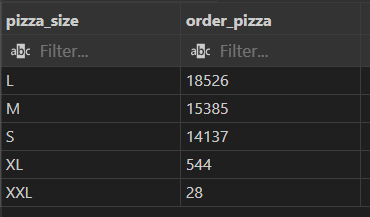
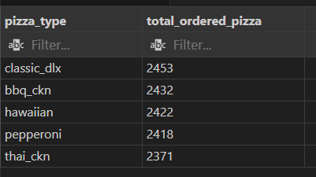
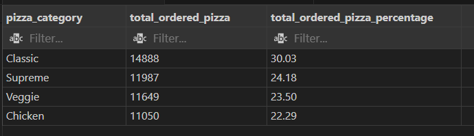
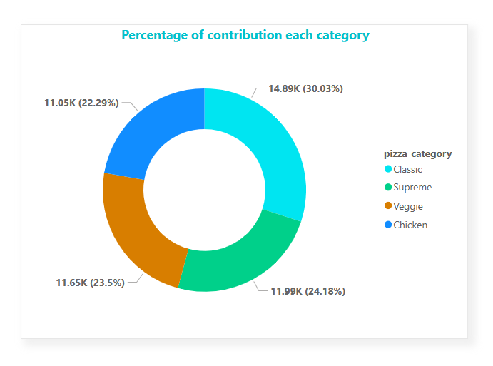
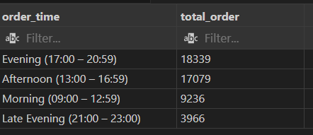
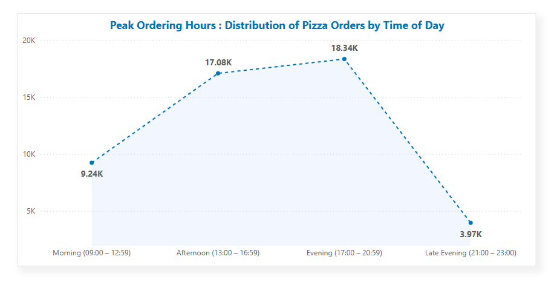
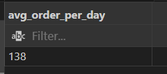
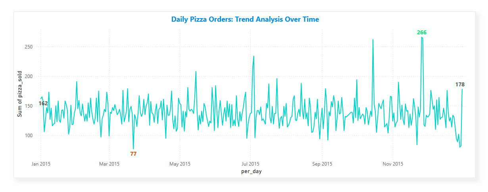
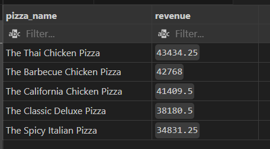
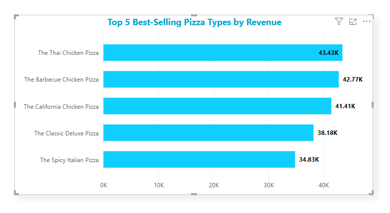

# Project Title

### Pizza Hut Sales Analysis

# Project Description

A comprehensive analysis of pizza sales data to uncover insights on revenue, order patterns, and customer preferences. The dataset includes pizza categories, types, prices, and order quantities, allowing us to evaluate performance by category, revenue contribution, and time-of-day distribution.

# Dataset Overview

### Description

The dataset includes the following key attributes:

- **Pizza Categories:** Classic, Supreme, Veggie, and Chicken.

- **Pizza Types:** Detailed breakdown of specific pizzas within each category.

- **Order Details:** Quantities and times of orders (from 9:00 AM to 11:00 PM).

- **Revenue Data:** Revenue generated by each pizza type and category.

# Objectives

- Analyze pizza sales distribution by category and type.

- Identify top revenue-generating pizzas.

- Examine sales patterns across different times of the day.

- Calculate revenue and order contribution percentages for categories and pizzas.

- Provide actionable insights for optimizing pizza offerings.

# Tool and Technology I Used

- **SQL:** The backbone of my analysis, allowing me to query the database and unearth critical insights.

- **PostgreSQL:** The chosen database management system, ideal for handling the job posting data.

- **Visual Studio Code:** My go-to for database management and executing SQL queries.

- **Git & GitHub:** Essential for version control and sharing my SQL scripts and analysis, ensuring collaboration and project tracking.

- **Power BI:** I can use these to create a greate visual to my SQL query result.
    

# The Analysis 

The analysis I have done using SQL queries.Each query for this project aimed at investigating specific aspects of sales analysis for this resturant. Here’s how I approached each question.

### 1. Retrieve the total number of orders placed.

```sql
SELECT
    count(order_id) AS Total_order_placed
FROM
    orders
```


This result indicates that a total of 21,350 pizzas were ordered across all entries in the year of 2015.

### 2. Calculate the total revenue generated from pizza sales.

Break down the total revenue by quarters (Q1, Q2, Q3, Q4) and provide the overall yearly revenue as well.

```sql
SELECT
   CASE
        WHEN EXTRACT(quarter FROM date) = 1 THEN 'Q1'
        WHEN EXTRACT(quarter FROM date) = 2 THEN 'Q2'
        WHEN EXTRACT(quarter FROM date) = 3 THEN 'Q3'
        WHEN EXTRACT(quarter FROM date) = 4 THEN 'Q4'
   END AS quarterly_revenue,
   Cast(sum(quantity*price) as decimal(10,2)) AS Total_revenue
FROM
    order_details
    LEFT JOIN pizzas
    ON order_details.pizza_id = pizzas.pizza_id
    LEFT JOIN orders
    ON order_details.order_id = orders.order_id
GROUP BY quarterly_revenue
ORDER BY quarterly_revenue ASC
```
### Here's the breakdown Total Revenue Quarterly..

- Total Annual Revenue: **$817,860.05**

- Revenues in Q1, Q2, and Q3 are relatively stable, ranging
   from **$205,016.20** to **$208,369.75.**

- Q4 has the lowest revenue at **$199,124.10**, about 3-4% lower than the other quarters.


I can create this line chart by using Power BI.

### 3. Identify the ( TOP - 10 ) highest-priced pizza.

```sql
SELECT
    name AS pizza_name,
    price,
    count(order_details.pizza_id) AS pizza_order
FROM
    pizza_types
    LEFT JOIN pizzas
    ON pizza_types.pizza_type_id = pizzas.pizza_type_id
    LEFT JOIN order_details
    ON pizzas.pizza_id = order_details.pizza_id
GROUP BY pizza_name , price
ORDER BY price  DESC
LIMIT 10;
```
### Here's the breakdown of TOP - 10 highest price pizza.

- **The Greek Pizza"** priced at **$35.95** has the lowest number of
   **orders (28)**, suggesting it might be too expensive.

- The lower-priced variant of **"The Greek Pizza"** at **$25.50** has 
   significantly more **orders (544)**, showing that demand improves when the price is reduced.

- Most pizzas priced at **$20.75** dominate in order volume: 

    1. **"The Spicy Italian Pizza": 1,088** orders (highest overall).

    2. **"The California Chicken Pizza": 895** orders.

    3. **"The Italian Supreme Pizza":** 735 orders.

- These results indicate that **$20.75** is a sweet spot for pricing, balancing affordability with customer demand.


### 4. Identify the most common pizza size ordered.

```sql
SELECT
    size AS pizza_size,
    count(order_id) AS order_pizza
FROM
    order_details
    LEFT JOIN pizzas
    ON order_details.pizza_id = pizzas.pizza_id
GROUP BY pizza_size
ORDER BY order_pizza DESC;
```

- Large **(L)** pizzas are the most ordered **(18,526 orders)**, indicating a strong preference for group or family-sized meals.

- **Medium (15,385)** and **Small (14,137)** pizzas also have high demand, showing that individual and personal-sized options are popular.

- Extra Large **(XL)** and **XXL** pizzas have very low demand (**544 and 28 orders**, respectively), suggesting they may not be cost-effective to stock.



### 5. List the top 5 most ordered pizza types along with their quantities.

```sql
SELECT
    pizza_types.pizza_type_id AS pizza_type,
    sum(quantity) AS total_ordered_pizza
FROM
    order_details
    LEFT JOIN pizzas
    ON order_details.pizza_id = pizzas.pizza_id
    LEFT JOIN pizza_types
    ON pizzas.pizza_type_id = pizza_types.pizza_type_id
GROUP BY pizza_type
ORDER BY total_ordered_pizza DESC
LIMIT 5;
```
- **Classic Deluxe (2,453 orders)** leads the ranking, indicating strong customer preference for traditional flavors.

- **BBQ Chicken (2,432)** and **Hawaiian (2,422)** pizzas follow closely, showing a demand for sweet-savory and smoky flavors.

- **Pepperoni (2,418)** remains a favorite classic choice, with consistent orders.

- **Thai Chicken (2,371)** rounds out the top 5, suggesting an interest in unique, spicy flavors.




### 6. find the total quantity of each pizza category ordered and Calculate the percentage each pizza category contributed.


```sql
SELECT
    category AS pizza_category,
    sum(quantity) AS total_ordered_pizza,

    Cast((
        (sum(quantity) / 
            ( -- Grand total is a subquery..
            SELECT
                CAST(sum(quantity) AS Decimal) AS total_ordered_pizza
            FROM
                order_details
                LEFT JOIN pizzas
                ON order_details.pizza_id = pizzas.pizza_id
            )
       )*100
    ) AS Decimal(10,2)) AS total_ordered_pizza_percentage
FROM
    order_details
    LEFT JOIN pizzas
    ON order_details.pizza_id = pizzas.pizza_id
    LEFT JOIN pizza_types
    ON pizzas.pizza_type_id = pizza_types.pizza_type_id
GROUP BY pizza_category
ORDER BY total_ordered_pizza_percentage DESC;
```

- The **Classic** category accounts for the largest share of sales,
   contributing **30.03%** of the total orders.

- **Veggie and Supreme** categories are performing well,
   contributing **23.50% and 24.18%**, respectively.

- These categories together represent nearly half **(47.68%)** of all
   orders, showing their significant role in overall sales.

- **Chicken pizzas** contribute **22.29%**, indicating they have a dedicated customer base, but lag slightly behind the other categories.

Here's the visual representation of this query.



Also I can added a pie chart to better visualization.


### 7. Determine the distribution of orders by hour of the day and Which time are the most ordered time in a day.

```sql
SELECT
    CASE
        WHEN EXTRACT(HOUR FROM time) BETWEEN 9 AND 12 THEN 'Morning (09:00 – 12:59)'
        WHEN EXTRACT(HOUR FROM time) BETWEEN 13 AND 16 THEN 'Afternoon (13:00 – 16:59)'
        WHEN EXTRACT(HOUR FROM time) BETWEEN 17 AND 20 THEN 'Evening (17:00 – 20:59)'
        WHEN EXTRACT(HOUR FROM time) BETWEEN 21 AND 23 THEN 'Late Evening (21:00 – 23:00)'
    END AS order_time,
    count(order_details.order_id) AS total_order
    
FROM
    order_details
    LEFT JOIN orders
    ON order_details.order_id = orders.order_id
GROUP BY order_time
ORDER BY total_order DESC;
```

- The **evening** section accounts for the highest **orders(18339)** of total orders,
indicating peak demand during dinner hours.

- **Afternoon** orders contribute **(17079)** orders  of the total orders, suggesting a strong
lunch crowd or mid-afternoon snack demand.

- The demand is concentrated during **afternoon and evening** hours, with **74.4%** of total
orders occurring between **13:00 and 20:59.**

Here's the visual representation of this query.



Also I can added a **Line Area** chart to better visualization.




### 8. Calculate the average number of pizzas ordered per day.

```sql
WITH order_per_day AS( -- Using CTE ..
SELECT
    date AS per_day,
    sum(order_details.quantity) AS pizza_sold
FROM
    order_details
    LEFT JOIN orders
    ON order_details.order_id = orders.order_id
GROUP BY date
ORDER BY date
)

SELECT
    CAST(avg(order_per_day.pizza_sold) AS DECIMAL(10,0)) AS avg_order_per_day
FROM
    order_per_day;
```

#### 138 orders per day on average.

### 9. Calculate the number of pizzas ordered per day

```sql
SELECT
    date AS per_day,
    sum(order_details.quantity) AS pizza_sold
FROM
    order_details
    LEFT JOIN orders
    ON order_details.order_id = orders.order_id
GROUP BY date
ORDER BY date;
```
### Here's the breakdown the number of pizzas ordered per day.

- 📈 Highest sales day: **November 26th (266 pizzas)** 

- 📉 Lowest sales day: **March 22th (77 pizzas)**


#### Visula representation of Daily Pizza Sales Trends



### 10. Determine the top 5 most ordered pizza types based on revenue.

```sql
SELECT
    pizza_types.name AS pizza_name,
    sum(quantity*price) AS revenue
FROM
    order_details
    LEFT JOIN pizzas
    ON order_details.pizza_id = pizzas.pizza_id
    LEFT JOIN pizza_types
    ON pizzas.pizza_type_id = pizza_types.pizza_type_id
GROUP BY pizza_type
ORDER BY revenue DESC
LIMIT 5;
```
- The **top 5 pizza** types together account for nearly **25%** of total revenue,
   indicating they are core contributors to the business’s sales.

- **The Thai Chicken pizza** is the best-performing individual pizza, contributing
   **$43434.25** of total revenue.

- The **Barbecue Chicken pizza** is the second best-performing individual pizza , 
   contributing **$42768** of total revenue.

- **The Classic Deluxe and Spicy Italian pizzas** contribute **$38180.5 and $34831.25**, respectively. While not chicken-based, these pizzas have steady demand.

Here's the visual representation of this query.



Also I can added a **Column** chart to better visualization.




