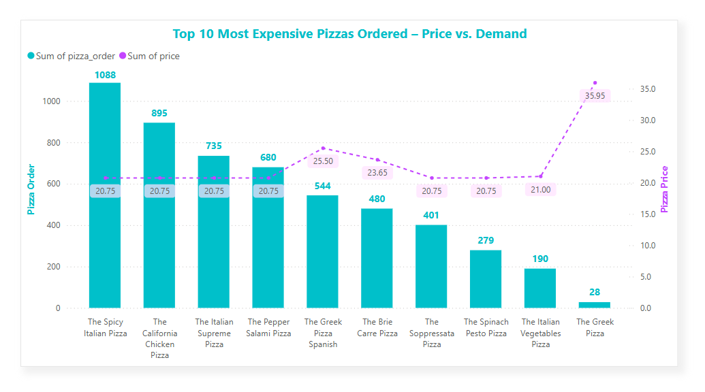

# Project Title

### Pizza Hut Sales Analysis

# Project Description

A comprehensive analysis of pizza sales data to uncover insights on revenue, order patterns, and customer preferences. The dataset includes pizza categories, types, prices, and order quantities, allowing us to evaluate performance by category, revenue contribution, and time-of-day distribution.

# Dataset Overview

### Description

The dataset includes the following key attributes:

- **Pizza Categories:** Classic, Supreme, Veggie, and Chicken.

- **Pizza Types:** Detailed breakdown of specific pizzas within each category.

- **Order Details:** Quantities and times of orders (from 9:00 AM to 11:00 PM).

- **Revenue Data:** Revenue generated by each pizza type and category.

# Objectives

- Analyze pizza sales distribution by category and type.

- Identify top revenue-generating pizzas.

- Examine sales patterns across different times of the day.

- Calculate revenue and order contribution percentages for categories and pizzas.

- Provide actionable insights for optimizing pizza offerings.

# Tool and Technology I Used

- **SQL:** The backbone of my analysis, allowing me to query the database and unearth critical insights.

- **PostgreSQL:** The chosen database management system, ideal for handling the job posting data.

- **Visual Studio Code:** My go-to for database management and executing SQL queries.

- **Git & GitHub:** Essential for version control and sharing my SQL scripts and analysis, ensuring collaboration and project tracking.

- **Power BI:** I can use these to create a greate visual to my SQL query result.
    

# The Analysis 

The analysis I have done using SQL queries.Each query for this project aimed at investigating specific aspects of sales analysis for this resturant. Here’s how I approached each question.

### 1. Retrieve the total number of orders placed.

```sql
SELECT
    count(order_id) AS Total_order_placed
FROM
    orders
```


This result indicates that a total of 21,350 pizzas were ordered across all entries in the year of 2015.

### 2. Calculate the total revenue generated from pizza sales.

Break down the total revenue by quarters (Q1, Q2, Q3, Q4) and provide the overall yearly revenue as well.

```sql
SELECT
   CASE
        WHEN EXTRACT(quarter FROM date) = 1 THEN 'Q1'
        WHEN EXTRACT(quarter FROM date) = 2 THEN 'Q2'
        WHEN EXTRACT(quarter FROM date) = 3 THEN 'Q3'
        WHEN EXTRACT(quarter FROM date) = 4 THEN 'Q4'
   END AS quarterly_revenue,
   Cast(sum(quantity*price) as decimal(10,2)) AS Total_revenue
FROM
    order_details
    LEFT JOIN pizzas
    ON order_details.pizza_id = pizzas.pizza_id
    LEFT JOIN orders
    ON order_details.order_id = orders.order_id
GROUP BY quarterly_revenue
ORDER BY quarterly_revenue ASC
```
### Here's the breakdown Total Revenue Quarterly..

- Total Annual Revenue: **$817,860.05**

- Revenues in Q1, Q2, and Q3 are relatively stable, ranging
   from **$205,016.20** to **$208,369.75.**

- Q4 has the lowest revenue at **$199,124.10**, about 3-4% lower than the other quarters.


I can create this line chart by using Power BI.

### 3. Identify the ( TOP - 10 ) highest-priced pizza.

```sql
SELECT
    name AS pizza_name,
    price,
    count(order_details.pizza_id) AS pizza_order
FROM
    pizza_types
    LEFT JOIN pizzas
    ON pizza_types.pizza_type_id = pizzas.pizza_type_id
    LEFT JOIN order_details
    ON pizzas.pizza_id = order_details.pizza_id
GROUP BY pizza_name , price
ORDER BY price  DESC
LIMIT 10;
```
### Here's the breakdown of TOP - 10 highest price pizza.

- **The Greek Pizza"** priced at **$35.95** has the lowest number of
   **orders (28)**, suggesting it might be too expensive.

- The lower-priced variant of **"The Greek Pizza"** at **$25.50** has 
   significantly more **orders (544)**, showing that demand improves when the price is reduced.

- Most pizzas priced at **$20.75** dominate in order volume: 

    1. **"The Spicy Italian Pizza": 1,088** orders (highest overall).

    2. **"The California Chicken Pizza": 895** orders.

    3. **"The Italian Supreme Pizza":** 735 orders.

- These results indicate that **$20.75** is a sweet spot for pricing, balancing affordability with customer demand.




